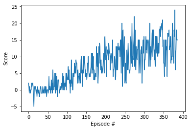

# Deep Reinforcement Learning
# Project 1 Report

## Learning algorithm

The algorithm is a Deep Q-Network, with Experience Replay and Fixed-Q Targets.

The Neural network had the following topography:
- Fully connected layer - input: 37 (state size) output: 128
- Fully connected layer - input: 128 output 64
- Fully connected layer - input: 64 output 32
- Fully connected layer - input: 32 output: 4 (action size)

It used Relu Activations. The Fixed-Q network was updated every forth episode.


For the DQN parameters, I used:
- Maximum steps per episode: 1000
- Starting epsilion: 1.0
- Ending epsilion: 0.01
- Epsilion decay rate: 0.99

The lower decay rate seems to speed up network learning, at the cost of increased noise.

## Results

The network trained very quicky, after 387 episode, which was much faster than the suggested 2000 episodes.


```
Episode 100	Average Score: 0.65
Episode 200	Average Score: 6.11
Episode 300	Average Score: 10.25
Episode 387	Average Score: 13.01
Environment solved in 287 episodes!	Average Score: 13.01
```


## Ideas for future work

1. Extensive hyperparameter optimization
2. Double Deep Q Networks
3. Prioritized Experience Replay
4. Dueling Deep Q Networks
5. RAINBOW Paper
6. Learning from pixels
